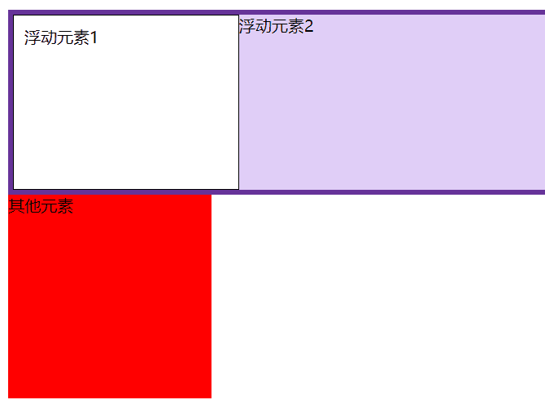

# BFC

MDN：块格式化上下文（Block Formatting Context，BFC） 是 Web 页面的可视化 CSS 渲染的一部分，是块盒子的布局过程发生的区域，也是浮动元素与其他元素交互的区域。 块格式化上下文包含创建它的元素内部的所有内容。

创建 BFC 是为了形成一个完全独立的空间，让空间中的子元素不会影响到外面的布局.
MDN 中列举了所有可以创建 BFC 的方式，以下是比较常用的方式：

- 1.浮动元素，即元素的`float`不是`none`。
- 2.绝对定位，即元素的`position`为`absolute`或者`fixed`。
- 3.`overflow`值部位`visible`。
- 4.`display`值为`flow-root`,它可以创建无副作用的 BFC。
- 5.行内块元素：`display`为`inline-block`。
- 6.弹性元素,`display`为 `flex` 或 `inline-flex`元素的直接子元素

BFC 可以用来解决 css 中的许多问题：

1. 浮动元素父元素高度坍塌

当父元素内的子元素浮动后，即子元素脱离了文档流，此时父元素的高度不能撑开，造成高度塌陷。

```css
//css
.box {
  background-color: rgb(224, 206, 247);
  border: 5px solid rebeccapurple;
}

.float {
  float: left;
  width: 200px;
  height: 150px;
  background-color: white;
  border: 1px solid black;
  padding: 10px;
}
.another {
  float: left;
}
.red {
  width: 200px;
  height: 200px;
  background: red;
}
```

```html
//html
<div class="box">
  <div class="float">浮动元素1</div>
  <div class="another">浮动元素2</div>
  <!-- <div style="clear: both;"></div> -->
</div>
<div class="red">其他元素</div>
```


创建 BFC 可以解决，即让父元素成为 BFC，这样其子元素就不会对其他元素有影响。

```css
.box {
  background-color: rgb(224, 206, 247);
  border: 5px solid rebeccapurple;
  overflow: auto;
  //也可以这样
  /* display: flow-root; */
}
```

 

2. 外边距垂直方向重合
块级元素的上外边距和下外边距有时会合并（或折叠）为一个外边距，其大小取其中的最大者，这种行为称为外边距折叠（margin collapsing），有时也翻译为外边距合并。 注意浮动元素和绝对定位元素的外边距不会折叠。**外边距折叠（Margin collapsing）也只会发生在属于同一 BFC 的块级元素之间。**

```css
.up {
  width: 100px;
  height: 20px;
  background: red;
  margin-bottom: 20px;
}

.down {
  width: 100px;
  height: 20px;
  background: green;
  margin-top: 30px;
}
```

```html
<div>
  <div class="up"></div>
  <div class="down"></div>
</div>
```

实验表明，上下两个 div 的垂直间距为 30px，而不是 20+30=50px,解决方法是让其中一个 div 外层包裹一个 BFC，这样上下两个 div 就隶属于不同的 BFC，就不存在重叠了。

```html
<div>
  <div class="up"></div>
  <div style="display: flow-root;">
    <div class="down"></div>
  </div>
</div>
```
