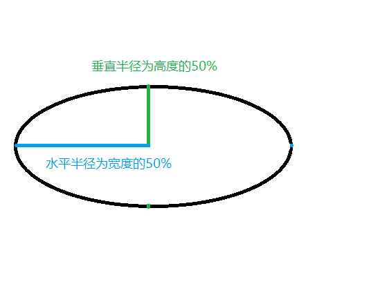
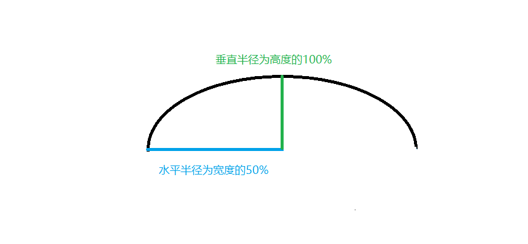
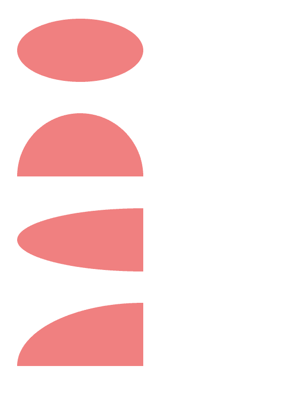

# css实现椭圆

背景知识：`border-radius`
对于`border-radius`，有一个鲜为人知的知识点：它可以单独指定水平和垂直半径，只要用一个斜杠（/）分隔开就可以。实现椭圆就要用到这一点。

1. 全椭圆
   以椭圆左上角为例，可以得到以下分析：


举一反三，其他三个角的水平半径和垂直半径都是高度或者宽度的 50%。转换为 css 代码，即`border-radius:50% 50% 50% 50% / 50% 50% 50% 50%`(顺序：左上角，右上角，右下角，左下角，顺时针方向)，简写`border-radius:50% / 50%`,再简写`border-radius:50%`

2. 半椭圆
   以椭圆的上半个椭圆的左上角为例，可以得到以下分析：


同样的方法，可以知道四个角的水平和垂直半径分别为`50%/100%,50%/100%,0/0,0/0`,即`border-radius:50% 50% 0 0 /100% 100% 0 0`

四分之一椭圆也可以用同样的方法来实现，就不再赘述，以下贴上全部代码：

```html
<!DOCTYPE html>
<html lang="en">
  <head>
    <meta charset="UTF-8" />
    <meta name="viewport" content="width=device-width, initial-scale=1.0" />
    <title>椭圆</title>
    <style>
      div {
        margin: 50px;
      }
      .ovals {
        width: 200px;
        height: 100px;
        border-radius: 50%;
        background: lightcoral;
      }
      .half-top-ovals {
        width: 200px;
        height: 100px;
        background: lightcoral;
        border-radius: 50% 50% 0 0 / 100% 100% 0 0;
      }
      .half-left-ovals {
        width: 200px;
        height: 100px;
        background: lightcoral;
        border-radius: 100% 0 0 100% / 50% 0 0 50%;
      }
      .quarter-top-left-ovals {
        width: 200px;
        height: 100px;
        background: lightcoral;
        border-radius: 100% 0 0 0/ 100% 0 0 0;
      }
    </style>
  </head>
  <body>
    <div class="ovals"></div>
    <div class="half-top-ovals"></div>
    <div class="half-left-ovals"></div>
    <div class="quarter-top-left-ovals"></div>
  </body>
</html>
```

效果：

