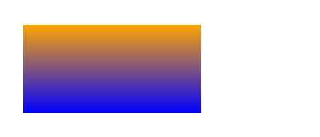
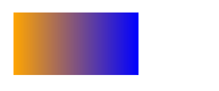
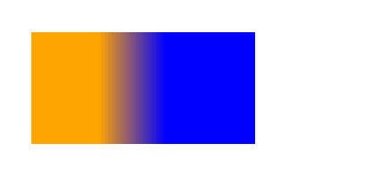
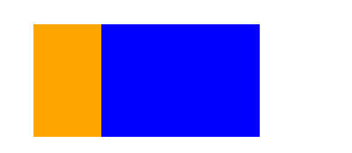
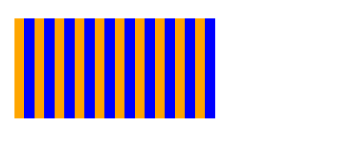
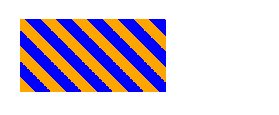

# css条纹

实现方法：CSS 线性渐变
`linear-gradient()` 函数用于创建一个表示两种或多种颜色线性渐变的图片。
`linear-gradient([ [ [ <angle> | to <side-or-corner> ],]? <color-stop>[, <color-stop>]+);`

- side-or-corner :
  描述渐变线的起始点位置。它包含 to 和两个关键词：第一个指出水平位置 left or right，第二个指出垂直位置 top or bottom。
- angle:
  用角度值指定渐变的方向（或角度）。角度顺时针增加。
- color-stop:
  由一个`color`值组成，并且跟随着一个可选的终点位置（可以是一个百分比值或者是沿着渐变轴的`length`）

例如，`background: linear-gradient(orange,blue);`意思是背景色从 orange 向 blue 渐变，默认方向从上往下，效果如下：

如果想从左往右渐变，则`background: linear-gradient(to right ,orange,blue);`

此外，还可以添加长度或者百分比来控制渐变的过程，例如`background: linear-gradient(to right ,orange 30%,blue 60%);`意思是从左往右 30%宽度为 orange 实色，从 60%宽度开始为 blue 实色，中间为渐变部分，效果如下：

如果我们把百分比设置成一样，`background: linear-gradient(to right ,orange 30%,blue 30%);`,效果是这样的：

这不就是最简单的渐变了吗？
因为背景默认会平铺填满，所以我们可以设置`background-size`值来控制条纹宽度。由此，我们可以实现竖条纹：

```css
.stripes {
  width: 200px;
  height: 100px;
  background: linear-gradient(to right, orange 50%, blue 50%);
  background-size: 20px;
}
```


横条纹同竖条纹原理一样，就不再赘述。如果要实现 45° 斜条纹呢？我们同样可以使用`linear-gradient()`实现，不过相对比较麻烦。这边推荐使用`repeating-linear-gradient()`,用法同`linear-gradient()`基本相同，只是色标是无限循环的，直到填满整个背景。例如：

```css
.stripes {
  width: 600px;
  height: 300px;
  background: repeating-linear-gradient(45deg, orange, orange 15px, blue 0, blue 30px);
}
```

效果如图：

