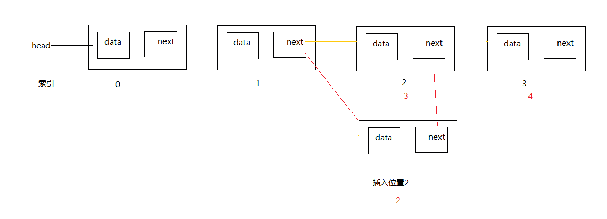

# 单向链表

单向链表（单链表）是链表的一种，其特点是链表的链接方向是单向的，对链表的访问要通过顺序读取从头部开始；链表是使用指针进行构造的列表；又称为结点列表，因为链表是由一个个结点组装起来的；其中每个结点都有指针成员变量指向列表中的下一个结点；列表是由结点构成，head 指针指向第一个成为表头结点，而终止于最后一个指向 NULL 的指针。


## JavaScript 实现

```js
function LinkedList() {
  function Node(data) {
    this.data = data;
    this.next = null;
  }
  this.head = null;
  this.length = 0;

  //append:向列表尾部添加一个项
  LinkedList.prototype.append = function (element) {
    //判断head是否为空
    if (this.head === null) {
      this.head = new Node(element);
    } else {
      //找到next为空的节点
      let current = this.head;
      while (current.next != null) {
        current = current.next;
      }
      current.next = new Node(element);
    }
    this.length++;
  };

  //insert(position,element):向列表的特定位置插入一个新的项
  LinkedList.prototype.insert = function (position, element) {
    if (position < 0 || position > this.length) return false;
    let node = new Node(element);
    if (position === 0) {
      let head = this.head;
      this.head = node;
      node.next = head;
    } else {
      let current = this.head;
      //找到对应位置的前一项
      while (position > 1) {
        current = current.next;
        position--;
      }
      //获取当前项的原始next值
      let pre = current.next;
      //让当前项的next指向插入的节点
      current.next = node;
      //让插入的节点的next值指向原始的next节点
      node.next = pre;
    }
    this.length++;
    return true;
  };

  //get(position):获取对应位置的元素
  LinkedList.prototype.get = function (position) {
    if (position < 0 || position > this.length - 1) return false;
    let current = this.head;
    while (position-- > 0) {
      current = current.next;
    }
    return current.data;
  };

  //indexOf(element):返回元素在列表中的索引。如果列表中没有则返回-1
  LinkedList.prototype.indexOf = function (element) {
    let current = this.head;
    let idx = 0;
    while (current) {
      if (current.data === element) {
        return idx;
      } else {
        current = current.next;
        idx++;
      }
    }
    return -1;
  };

  //removeAt(position):从列表的特定位置移除一项
  LinkedList.prototype.removeAt = function (position) {
    if (position < 0 || position >= this.length) return false;
    if (position === 0) {
      this.head = this.head.next;
    } else {
      let current = this.head;
      while (position > 1) {
        current = current.next;
        position--;
      }
      current.next = current.next.next;
    }
    this.length--;
  };

  //remove(element):从列表中移除一项
  LinkedList.prototype.remove = function (element) {
    let idx = this.indexOf(element);
    return this.removeAt(idx);
  };

  //isEmpty():判断链表是否为空
  LinkedList.prototype.isEmpty = function () {
    return this.length === 0;
  };

  //size():返回链表中元素的个数
  LinkedList.prototype.size = function () {
    return this.length;
  };

  //toString():字符串表达
}

let l = new LinkedList();
l.append(1);
l.append(3);
l.append(11);
l.insert(2, 5);
l.insert(3, 7);
l.insert(5, 0);
l.removeAt(3);
console.log(l);
```


